# Family Organizer

I created this app after seeing some friends get Magic Mirror and DAKboard. I didn't want to pay a subscription, I wanted something self-hosted with all the features, and I thought it would make a fun AI coding project. This is meant to run on a Raspberry Pi or Linux host, but since it runs in containers, it can also run on a Windows host. 

Requriments - 
* [Open Weather Map API Key](https://openweathermap.org/api)
* [Gmail Oauth app for your google calander ](https://developers.google.com/identity/protocols/oauth2)
Optional 
* [Tailscale account](https://tailscale.com/)

---

## Features
- **Dashboard** — Drag-and-resize widget grid, 16 themes, custom background photo with opacity and fit mode (fill/contain), customizable mobile bottom tab bar, kiosk display mode
- **Calendar** — Google Calendar sync, day/week/month views, manual events
- **Tasks** — Simple todo list with quick-add, open/closed status, assignees, due dates, and recurrence
- **Chores** — Rotation scheduling (round-robin / weighted / manual), streaks, reward points
- **Grocery Lists** — Shopping mode, bulk add, low-stock auto-populate
- **Inventory** — Pantry tracker with low-stock thresholds and export
- **Meal Plans** — Weekly planner with recipe management, ingredient inventory checking, grocery list integration, and bulk recipe import (paste text or upload JSON)
- **Reminders & Notifications** — Web push and email notifications with configurable lead times
- **Multi-user** — Role-based access (Admin / Member / Viewer), per-user colors


---

## Screenshots

### Login & Dashboard

| Login | Dashboard — Desktop | Dashboard — Mobile |
|-------|--------------------|--------------------|
| 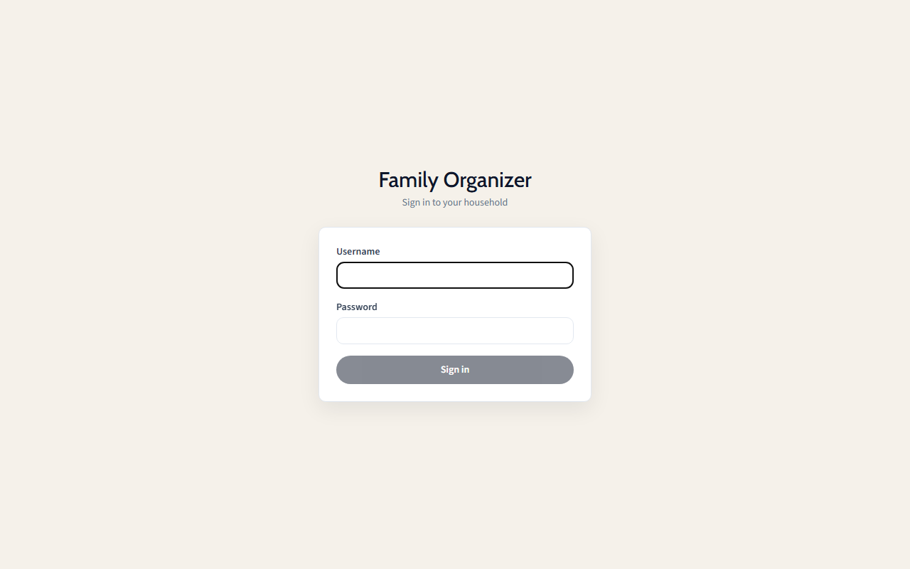 | 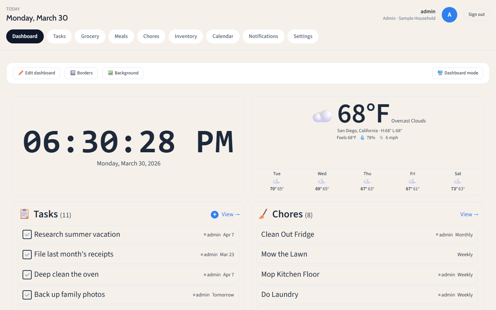 | 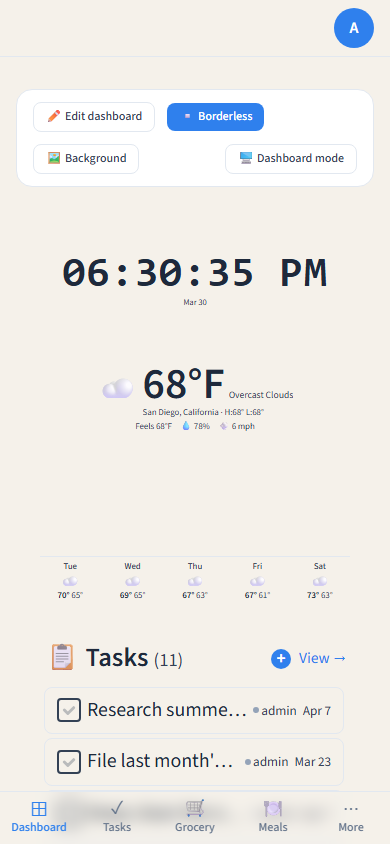 |

### Tasks · Chores · Grocery

| Tasks | Chores | Grocery |
|-------|--------|---------|
| 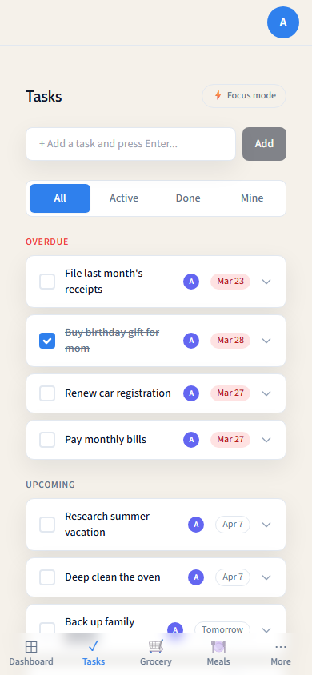 | 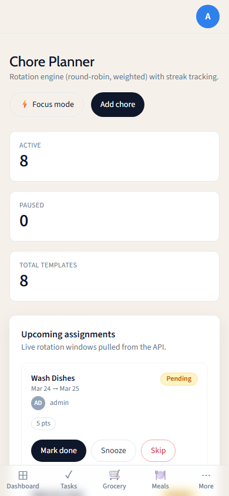 | 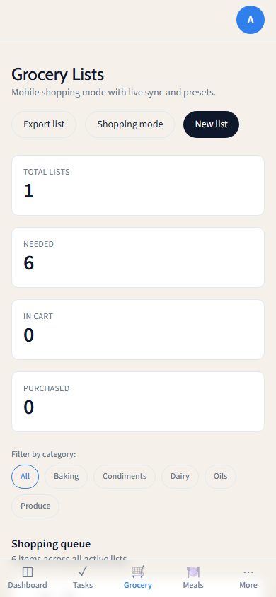 |

### Inventory · Meal Plans · Recipes

| Inventory | Meal Plans | Recipes |
|-----------|------------|---------|
| 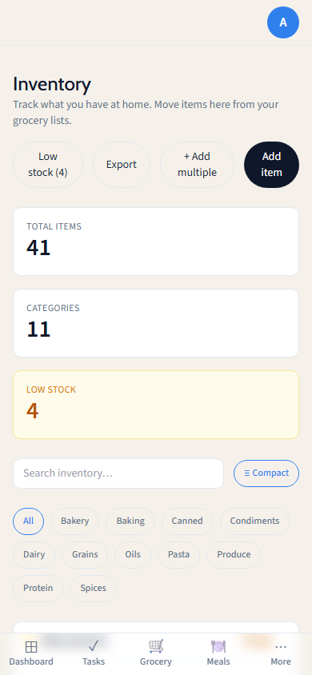 | 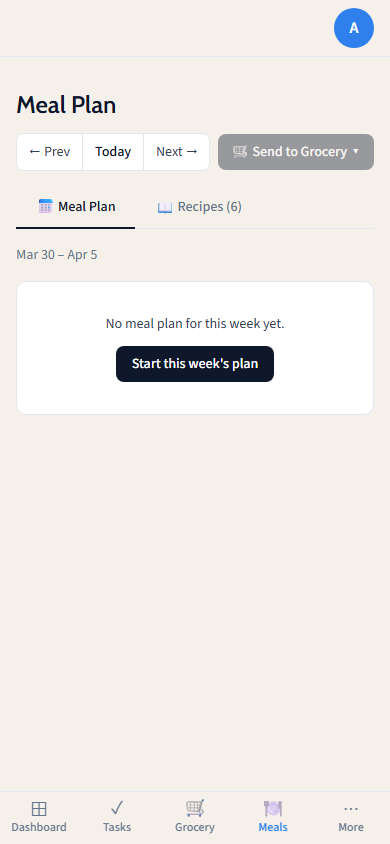 | 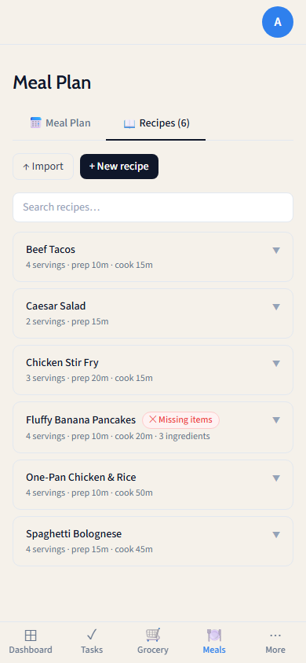 |

### Calendar · Settings

| Calendar (Week) | Calendar (Month) | Settings |
|-----------------|------------------|---------|
| 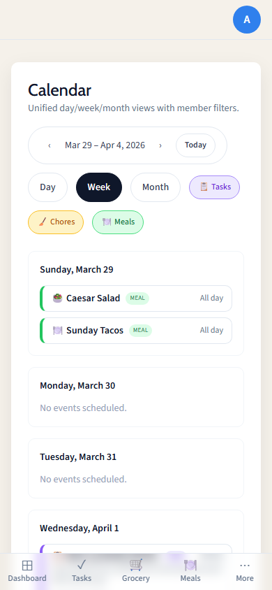 | 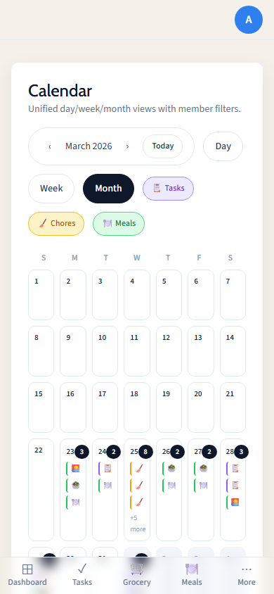 | 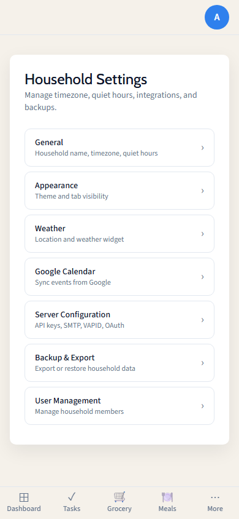 |

---

## Quick Start

```bash
git clone https://github.com/wadingthrulogs/family-organizer.git
cd family-organizer
chmod +x setup.sh
bash setup.sh
```


The wizard generates secrets, writes `backend/.env`, and builds and starts the app.

**Windows users:** Run in WSL2.
**Default URL:** `http://localhost:80`. The setup wizard will show the exact URL.
**After setup:** The script will display the app URL and a direct link to `/register` — open it to create your admin account.
**Reconfigure:** Most settings (API keys, SMTP, push notifications, weather) can be changed via **Settings → Server Configuration** in the app (admin only).


Full guide: [docs/deployment.md](docs/deployment.md)

### Enable HTTPS with Tailscale (recommended)

After the initial setup, run the Tailscale setup script to get free, browser-trusted HTTPS on your local network — no port-forwarding or certificate management required:

```bash
bash tailscale-setup.sh
```

The script will:
1. Install Tailscale if not already present
2. Detect your MagicDNS hostname (e.g. `mymachine.tail411eff.ts.net`)
3. Issue a TLS certificate and configure nginx for HTTPS
4. Update your `.env` files and rebuild the containers

Your app will be available at `https://<your-hostname>` when it finishes.

> **If you use Google Calendar:** after running the script, add your new HTTPS redirect URI in [Google Cloud Console](https://console.cloud.google.com) → APIs & Services → Credentials → your OAuth client → Authorised redirect URIs:
> ```
> https://<your-hostname>/api/v1/integrations/google/callback
> ```

See [Tailscale-guide.md](Tailscale-guide.md) or the [Tailscale HTTPS](#tailscale-https-recommended) section below for renewal, cron setup, and troubleshooting.

---

## Post-Setup Configuration

After the initial setup, most optional settings can be changed **directly in the app** without
editing files or restarting the server. Log in as an admin and go to **Settings**.

### Configurable via Settings UI (Admin → Server Configuration)

| Setting | UI Label |
|---------|----------|
| OpenWeatherMap API key | Weather → API Key |
| SMTP host, port, user, password, from address | Email → SMTP |
| Web push VAPID keys | Push Notifications → VAPID Keys |
| Google OAuth client ID & secret | Google Calendar → Credentials |
| App base URL | Server → App Base URL *(restart required)* |

Sensitive values (secrets, passwords, VAPID keys) are encrypted at rest in the database.
The UI shows a "configured" badge instead of revealing stored values.

### Still requires `backend/.env` + `make restart`

These are foundational settings that must be present at startup:

| Variable | Purpose |
|----------|---------|
| `SESSION_SECRET` | Cookie signing key (≥16 chars) |
| `ENCRYPTION_KEY` | Secret encryption key (≥32 chars) |
| `DATABASE_URL` / `SQLITE_PATH` | Database file location |
| `PORT` | Server port |
| `NODE_ENV` | Runtime environment |

---

## Common Commands

| Command | What it does |
|---------|-------------|
| `make setup` | Run setup wizard (first-time install or quick restart) |
| `make reconfigure` | Re-run setup wizard to change configuration |
| `make up` | Build and start all containers |
| `make down` | Stop and remove containers (data is preserved) |
| `make restart` | Restart containers without rebuilding |
| `make logs` | Follow live logs |
| `make status` | Show container health |
| `make backup` | Save timestamped DB backup to `./backups/` |
| `make restore FILE=path` | Restore DB from backup |
| `make update` | Pull latest code and rebuild |
| `make shell-backend` | Open a shell inside the running backend container |
| `make tailscale-setup` | Set up Tailscale HTTPS (cert, nginx, env, rebuild) |
| `make tailscale-renew` | Renew Tailscale cert and reload nginx (no rebuild) |

---

## Google Calendar Integration (optional)

To sync Google Calendars, you need a free OAuth 2.0 client from Google Cloud.

### 1. Create a Google Cloud Project

1. Go to [console.cloud.google.com](https://console.cloud.google.com/)
2. Click the project dropdown (top-left) → **New Project**
3. Give it a name (e.g. `Family Organizer`) and click **Create**

### 2. Enable the Google Calendar API

1. In the left sidebar go to **APIs & Services → Library**
2. Search for **Google Calendar API** and click it
3. Click **Enable**

### 3. Create OAuth 2.0 Credentials

1. Go to **APIs & Services → Credentials**
2. Click **Create Credentials → OAuth client ID**
3. If prompted, configure the **OAuth consent screen** first:
   - User type: **External** → fill in app name and your email → save
4. Back on Create OAuth client ID:
   - Application type: **Web application**
   - Name: anything (e.g. `Family Organizer`)
   - Under **Authorised redirect URIs**, click **Add URI** and enter:
     ```
     <APP_BASE_URL>/api/v1/integrations/google/callback
     ```
     Replace `<APP_BASE_URL>` with your actual URL from setup.
     Examples:
     - `http://localhost:80/api/v1/integrations/google/callback` *(initial setup)*
     - `https://familyorganizer.tail411eff.ts.net/api/v1/integrations/google/callback` *(Tailscale HTTPS)*
5. Click **Create** — a dialog will show your **Client ID** and **Client Secret**

### 4. Add Test Users (Required while app is in Testing mode)

By default, Google keeps new OAuth apps in **Testing** mode. In this mode, only explicitly approved email addresses can complete the Google sign-in — anyone else will see an "Access blocked" error.

1. Go to **APIs & Services → OAuth consent screen**
2. Click the **Audience** tab (previously labelled "Test users")
3. Under **Test users**, click **+ Add Users**
4. Enter the Gmail address of each Google account you want to connect (e.g. the family calendar owner's address)
5. Click **Save**

> **Tip:** You need to add every Google account you plan to link in Family Organizer — not just your own. If a family member wants to sync their personal calendar, add their address here too.

You can leave the app in Testing mode indefinitely for personal/household use — there's no need to go through Google's verification process.

### 5. Add the Credentials to `backend/.env`

Open `backend/.env` and fill in these two lines:

```env
GOOGLE_CLIENT_ID=your-client-id-here.apps.googleusercontent.com
GOOGLE_CLIENT_SECRET=your-client-secret-here
```

`GOOGLE_REDIRECT_URL` can be left blank — it is derived automatically from `APP_BASE_URL`.

Then restart the app:

```bash
make restart
```

### 6. Connect Your Google Account

Log in to Family Organizer → **Settings → Google Calendar** → **Connect Google Account**.
After authorising, your calendars will appear under **Settings → Google Calendar** to enable sync.

---

## Importing Recipes

Open **Meal Plans → Recipes** and click **↑ Import**.

### Paste text

Paste one or more recipes separated by a blank line. The first line of each block is the title; the remaining lines are ingredients (quantity, unit, and name in any natural order).

```
Pasta Bolognese
500g beef mince
2 cans diced tomatoes
1 onion
2 cloves garlic

Chicken Stir Fry
2 chicken breasts
1 cup broccoli
2 tbsp soy sauce
1 tbsp sesame oil
```

### Upload JSON

Upload a `.json` file containing an array of recipe objects. All fields except `title` are optional.

```json
[
  {
    "title": "Pasta Bolognese",
    "description": "Classic Italian meat sauce",
    "servings": 4,
    "prepMinutes": 15,
    "cookMinutes": 45,
    "sourceUrl": "https://example.com/pasta-bolognese",
    "ingredients": [
      { "name": "beef mince", "quantity": 500, "unit": "g" },
      { "name": "diced tomatoes", "quantity": 2, "unit": "cans" },
      { "name": "onion", "quantity": 1 },
      { "name": "garlic", "quantity": 2, "unit": "cloves" }
    ]
  },
  {
    "title": "Chicken Stir Fry",
    "servings": 2,
    "cookMinutes": 20,
    "ingredients": [
      { "name": "chicken breasts", "quantity": 2 },
      { "name": "broccoli", "quantity": 1, "unit": "cup" },
      { "name": "soy sauce", "quantity": 2, "unit": "tbsp" }
    ]
  }
]
```

---

## Tailscale HTTPS (Recommended)

Tailscale issues free, browser-trusted TLS certificates for any machine on your tailnet — no
Certbot, no Let's Encrypt, no port-forwarding needed. HTTPS is required for secure session
cookies and browser push notifications.

### What `tailscale-setup.sh` does automatically

Run it from the repo root:

```bash
bash tailscale-setup.sh
```

The script handles everything in order:

1. **Installs Tailscale** on the host if not already installed (Linux/macOS/WSL2)
2. **Detects your Tailscale MagicDNS hostname** (e.g. `mymachine.tail411eff.ts.net`) from `tailscale status`
3. **Issues a TLS certificate** via `tailscale cert` and saves it to `/etc/tailscale/certs/`
4. **Patches `frontend/nginx.conf`** — switches `listen 80` to `listen 443 ssl`, sets `server_name` to your hostname, and adds the `ssl_certificate` directives
5. **Updates `.env` and `backend/.env`** — sets `APP_BASE_URL=https://<hostname>`, `APP_PORT=443`, and `SESSION_SECURE=true`
6. **Rebuilds and restarts containers** — runs `docker compose down && docker compose up -d --build`
7. **Polls the health endpoint** until the app responds over HTTPS
8. **Optionally installs a weekly cron** to renew the certificate and reload nginx without downtime

After the script finishes, open `https://<your-hostname>` — you should see the padlock.

### What you still need to do manually

**If you use Google Calendar**, update your OAuth redirect URI in Google Cloud Console:

1. Go to [console.cloud.google.com](https://console.cloud.google.com) → **APIs & Services → Credentials**
2. Click your OAuth client → **Authorised redirect URIs**
3. Add:
   ```
   https://<your-hostname>/api/v1/integrations/google/callback
   ```
4. Click **Save**

> **Tip:** Open **Settings → Server Configuration** in the app — the Google OAuth section shows the exact URIs you need to register, pre-filled with your current `APP_BASE_URL`.

### Re-running and renewal

```bash
bash tailscale-setup.sh --renew   # Re-issue cert + reload nginx (no rebuild)
bash tailscale-setup.sh --cron    # Install/update the weekly renewal cron only
```

The setup script (`bash setup.sh`) preserves your Tailscale hostname across restarts and will not overwrite a configured `APP_BASE_URL`.


---

## Development

```bash
# Backend (port 3000)
cd backend
cp .env.example .env
npm install
npx prisma migrate dev
npm run dev

# Frontend (port 80, Vite dev server) — separate terminal
cd frontend
npm install
npm run dev
```

> **Note:** Port 80 is the Vite dev server used during development.
> The Docker deployment (nginx) defaults to port **80**. Port 443 is used after Tailscale HTTPS setup.
>
> **Windows note:** Port 80 requires elevated privileges. If `npm run dev` fails with `EACCES` or `permission denied`, run your terminal as Administrator.

The Vite dev server proxies `/api` to `http://localhost:3000` automatically.

---

## Tech Stack

| Layer | Technology |
|-------|-----------|
| Backend | Node 20, TypeScript, Express 4, Prisma 5, SQLite |
| Auth | express-session, bcrypt |
| Frontend | React 18, TypeScript, Vite, Tailwind CSS |
| Data fetching | TanStack Query v5 |
| Drag & drop | react-grid-layout (dashboard) |
| Deployment | Docker Compose, Nginx |

---

## Documentation

| Doc | Description |
|-----|-------------|
| [docs/deployment.md](docs/deployment.md) | Full deployment guide — Docker, reverse proxy, env vars, backups |
| [docs/architecture.md](docs/architecture.md) | System architecture overview |
| [docs/api.md](docs/api.md) | API endpoint reference |
| [docs/data-model.md](docs/data-model.md) | Database schema and entity relationships |
| [docs/requirements.md](docs/requirements.md) | Functional and non-functional requirements |
| [docs/release-checklist.md](docs/release-checklist.md) | Release and deployment runbook |
| [docs/perf-audit-2026-04.md](docs/perf-audit-2026-04.md) | Performance audit findings and fixes |
| [docs/ui-wireframes.md](docs/ui-wireframes.md) | UI wireframes and design notes |
| [Tailscale-guide.md](Tailscale-guide.md) | HTTPS setup via Tailscale — certs, renewal, Google OAuth fix |
| [CONTRIBUTING.md](CONTRIBUTING.md) | How to contribute |
| [CHANGELOG.md](CHANGELOG.md) | Release history |

---

## License

[MIT](LICENSE)
